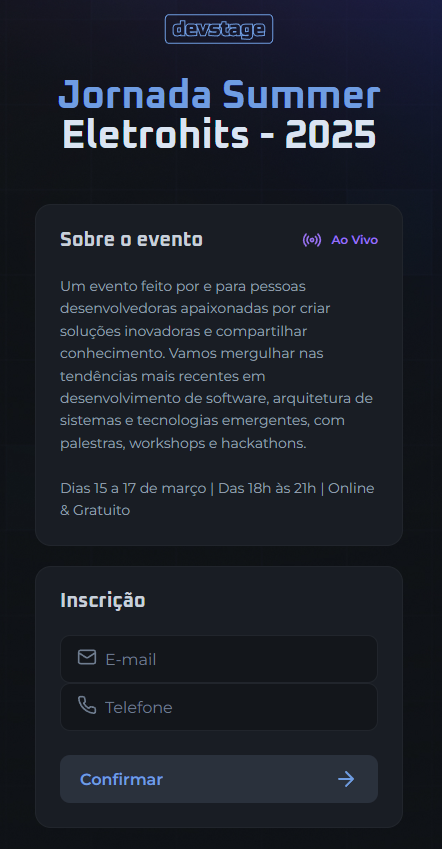

# Summer Eletrohits

Este projeto foi desenvolvido durante a **19ª edição da Next Level Week** (NLW) da Rocketseat, na trilha **Full Stack**.

## 🚀 Sobre o Projeto

O **Summer Eletrohits** é uma **Single Page Application (SPA)** criada com **HTML, CSS e JavaScript**, onde foram aplicados conceitos fundamentais de programação, estruturação de páginas web e estilização responsiva.

## 🛠 Tecnologias Utilizadas

- **HTML**: Estrutura da página
- **CSS**: Estilização e responsividade
- **JavaScript**: Aplicação de lógica de programação



## 📂 Como Baixar e Executar o Projeto

Para clonar e executar este projeto localmente, siga os passos abaixo:

```bash
# Clone o repositório
$ git clone https://github.com/thiagogmta/summerEletrohits.git

# Acesse a pasta do projeto
$ cd summerEletrohits

# Abra o arquivo index.html no navegador
```

## 📌 Funcionalidades

- [x] Estruturação de página com HTML
- [x] Estilização avançada com CSS
- [x] Aplicação de lógica com JavaScript

---

Enjoy! @thiagogmta